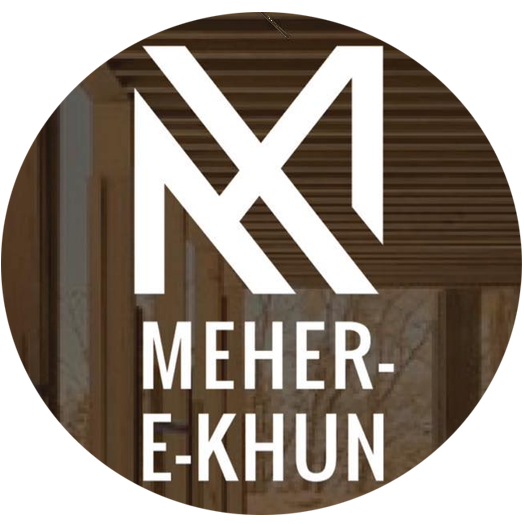

# Meher-e-Khun - Cultural Hub & Artist Residency



A professional, responsive website for Meher-e-Khun - a dynamic social enterprise nestled in the serene beauty of Hundur Village, Yasin Valley, Northern Pakistan.

## About Meher-e-Khun

Meher-e-Khun is dedicated to nurturing the vibrant musical spirit of Northern Pakistan's youth, preserving its rich musical heritage, and fostering global artistic exchange. We provide a safe haven for budding musicians and create sustainable economic opportunities for the local community through cultural tourism and skill development programs.

### Our Mission
- Nurture musical talent and preserve cultural heritage
- Foster global artistic exchange through residency programs
- Create sustainable economic opportunities for local communities
- Provide skill development and mental health wellbeing programs

## Features

### Website Features
- **Responsive Design**: Fully optimized for all devices (desktop, tablet, mobile)
- **Sticky Navigation**: Fixed header for easy navigation
- **Image Slider**: Auto-rotating hero section with multiple slides
- **Modern UI/UX**: Clean, professional design with smooth animations
- **Google Maps Integration**: Interactive location map
- **Fast Loading**: Optimized for performance
- **Cross-browser Compatible**: Works on all modern browsers

### Technical Features
- Pure HTML5, CSS3, and JavaScript (no frameworks required)
- Mobile-first responsive design
- CSS Grid and Flexbox layouts
- Smooth scrolling navigation
- Touch-friendly mobile interface
- SEO-optimized structure

## 📁 Project Structure
meherekhun.github.io/
│<br>
├── index.html # Main website file<br>
├── logo.png # Organization logo<br>
├── meherekhun1.jpg # Slider image 1<br>
├── meherekhun2.jpg # Slider image 2<br>
├── meherekhun3.jpg # Slider image 3<br>
└── README.md<br> # Project documentation<br>


## 🛠️ Installation & Setup

### Option 1: GitHub Pages (Recommended)
1. Fork this repository
2. Go to repository Settings → Pages
3. Select "Deploy from a branch" and choose main branch
4. Your site will be live at `https://yourusername.github.io/meherekhun.github.io`

### Option 2: Local Development
1. Clone the repository:
   ```bash
   git clone https://github.com/meherekhun/meherekhun.github.io.git

📞 Contact Information<br>
Meher-e-Khun<br>
Hundur, Yasin Valley, 15310
Northern Pakistan<br>
📞 Phone: 0355 5697565<br>
📧 Email: meherekhun@gmail.com<br>

👨‍💻 Developer<br>
Developed by Sardar Ali Khamosh<br>

Portfolio: https://sardaralikhamosh.github.io <br>

GitHub: @sardaralikhamosh

📄 License
This project is licensed under the MIT License - see the LICENSE file for details.

## Contributing
Fork the project

Create your feature branch (git checkout -b feature/AmazingFeature)

Commit your changes (git commit -m 'Add some AmazingFeature')

Push to the branch (git push origin feature/AmazingFeature)

Open a Pull Request

## Issues
If you find any issues, please create an issue on GitHub.

## Support the Mission<br>
Help us preserve Northern Pakistan's rich cultural heritage and support local artists. Visit Meher-e-Khun in Yasin Valley or contact us to learn about our programs and how you can contribute.<br>

Join us in creating a brighter, more harmonious world through cultural exchange and artistic expression. 
<br>
## Additional Files You Might Want to Create:

### 1. LICENSE File (MIT License)
```markdown
MIT License

Copyright (c) 2024 Meher-e-Khun

Permission is hereby granted, free of charge, to any person obtaining a copy
of this software and associated documentation files (the "Software"), to deal
in the Software without restriction, including without limitation the rights
to use, copy, modify, merge, publish, distribute, sublicense, and/or sell
copies of the Software, and to permit persons to whom the Software is
furnished to do so, subject to the following conditions:

The above copyright notice and this permission notice shall be included in all
copies or substantial portions of the Software.

THE SOFTWARE IS PROVIDED "AS IS", WITHOUT WARRANTY OF ANY KIND, EXPRESS OR
IMPLIED, INCLUDING BUT NOT LIMITED TO THE WARRANTIES OF MERCHANTABILITY,
FITNESS FOR A PARTICULAR PURPOSE AND NONINFRINGEMENT. IN NO EVENT SHALL THE
AUTHORS OR COPYRIGHT HOLDERS BE LIABLE FOR ANY CLAIM, DAMAGES OR OTHER
LIABILITY, WHETHER IN AN ACTION OF CONTRACT, TORT OR OTHERWISE, ARISING FROM,
OUT OF OR IN CONNECTION WITH THE SOFTWARE OR THE USE OR OTHER DEALINGS IN THE
SOFTWARE.

